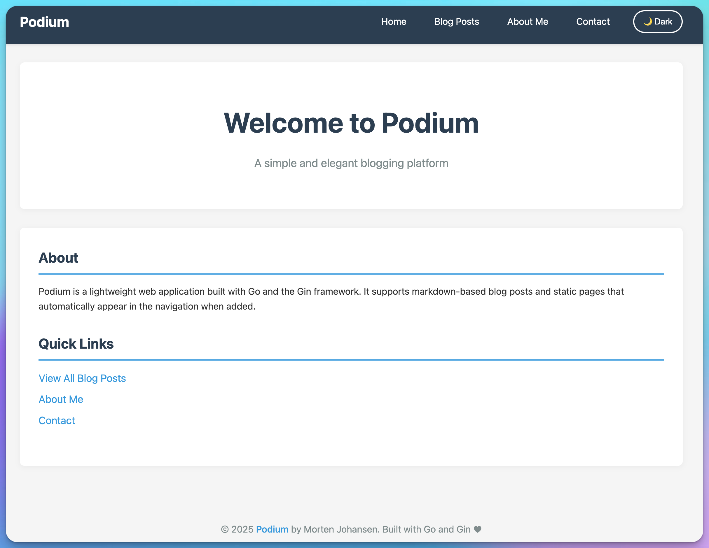
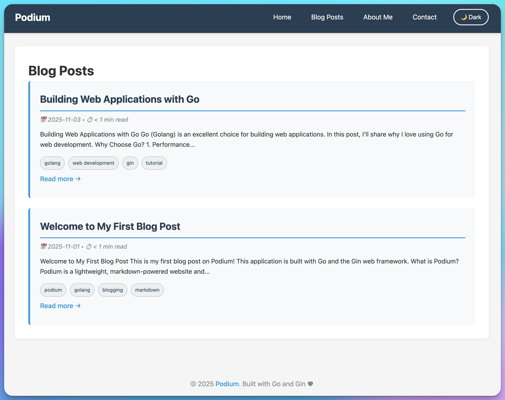
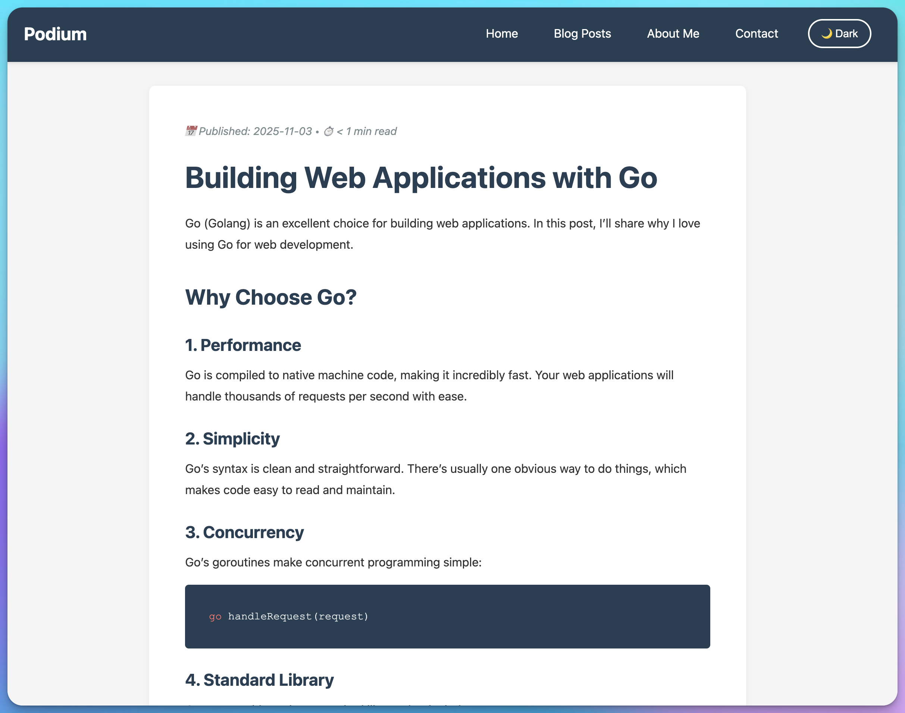
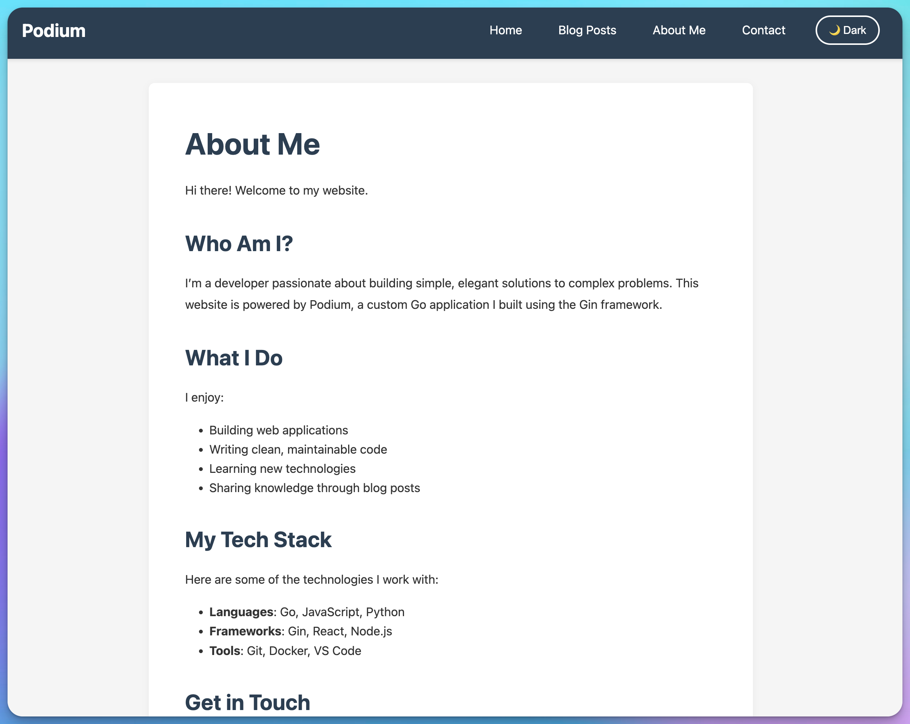

# Podium

A lightweight Go web application for hosting your website with blog posts and static pages, all written in Markdown.

## Screenshots


_Clean, responsive design with dark/light theme toggle_


_Blog posts with excerpts, tags, and reading time estimates_


_Individual blog post with syntax highlighting and share buttons_


_Mobile-responsive design with touch-friendly navigation_

## Features

- 🚀 Built with Go and the Gin web framework
- 📝 Write blog posts in Markdown
- 📄 Create static pages in Markdown
- 🔄 Automatic navigation generation - new static pages automatically appear in the menu
- 🎨 Clean, responsive design with **dark/light theme toggle**
- ⚡ Fast and lightweight with **HTTP caching**, **lazy-loaded images**, and **asset minification**
- �️ **Image optimization** with automatic resizing and quality optimization
- �🔧 **Cross-platform system service support** (Windows, macOS, Linux)
- 🏷️ **Tags support** for blog posts with automatic filtering
- 💻 **Syntax highlighting** for code blocks (140+ languages via highlight.js)
- 📅 **Date timestamps** for blog posts with newest-first sorting
- ⭐ **Featured posts** - Pin important posts to the top of the blog list
- 📆 **Post scheduling** - Publish posts automatically at future dates/times
- 📄 **Draft support** - hide posts and pages until ready to publish
- 🔖 **Post excerpts** on list pages with configurable length
- ⏱️ **Reading time estimates** for blog posts
- 📱 **Mobile-responsive design** with touch-friendly navigation
- 🖨️ **Print-friendly CSS** for clean article printing
- 📡 **RSS/Atom feed** for blog subscribers
- 🗺️ **Sitemap.xml** with automatic post/page indexing
- 📄 **Pagination** for long post lists
- 🔗 **Share buttons** for social media (Twitter, LinkedIn, Facebook, Reddit)
- 📋 **Copy code button** for easy code snippet copying
- ⚙️ **YAML configuration** for easy customization
- 🔥 **Config hot reload** - Configuration changes apply instantly without restart
- 🔄 **Hot reload** in development mode for faster iteration

## Project Structure

```
podium/
├── main.go                  # Main application with service support
├── go.mod                   # Go module file
├── go.sum                   # Go dependencies checksums
├── Makefile                 # Build and service management commands
├── build.sh                 # Build script for Linux/macOS
├── build.bat                # Build script for Windows
├── README.md                # This file
├── SERVICE.md               # Detailed service documentation
├── SERVICE-FEATURES.md      # Service features overview
├── QUICKREF.md              # Quick reference guide
├── .gitignore               # Git ignore file
│
├── install-service.sh       # Linux/macOS service installer
├── uninstall-service.sh     # Linux/macOS service uninstaller
├── install-service.bat      # Windows service installer
├── uninstall-service.bat    # Windows service uninstaller
│
├── bin/                     # Build output directory
│   └── .gitkeep             # Keeps directory in git
│
├── posts/                   # Blog posts (Markdown files)
│   ├── first-post.md
│   └── golang-web-dev.md
│
├── static/                  # Static pages (Markdown files)
│   ├── about.md
│   └── contact.md
│
├── templates/               # HTML templates
│   ├── index.html           # Home page
│   ├── page.html            # Static page template
│   ├── posts.html           # Blog posts list
│   ├── post.html            # Individual post template
│   └── error.html           # Error page
│
└── assets/                  # Static assets (CSS, images, etc.)
    ├── style.css            # Main stylesheet
    ├── theme-toggle.js      # Theme switching functionality
    ├── share-buttons.js     # Social share functionality
    └── favicon.svg          # Site icon
```

## Getting Started

### Prerequisites

- Go 1.16 or higher

### Installation

1. Clone or navigate to the repository
2. Install dependencies:

```bash
go mod download
```

### Configuration

Podium uses a `config.yaml` file to configure your site. Create a `config.yaml` file in the root directory with the following settings:

```yaml
# Site Settings
site_title: "Podium"
site_description: "A simple and elegant blogging platform"
site_author: "Morten Johansen"
site_author_url: "https://johansen.foo"
site_url: "http://localhost:8080"
home_intro: "Podium is a lightweight web application built with Go and the Gin framework. It supports markdown-based blog posts and static pages that automatically appear in the navigation when added."
show_quick_links: true

# Server Settings
port: 8080

# Pagination
posts_per_page: 10

# RSS Feed
feed_items: 20

# Excerpts
excerpt_length: 200

# Social Media Links
show_social_links: true
social_twitter: ""
social_bluesky: ""
social_linkedin: ""
social_github: ""
social_reddit: ""
social_facebook: ""

# Analytics
umami_script_url: "" # e.g., "https://analytics.yourdomain.com/script.js"
umami_website_id: "" # Your Umami website ID

# Paths (relative to application root)
posts_folder: "posts"
static_folder: "static"
templates_folder: "templates"
assets_folder: "assets"
```

**Configuration Options:**

- `site_title` - The name of your website (appears in navigation and page titles)
- `site_description` - A brief description of your site (used in meta tags and homepage)
- `site_author` - Your name (appears in footer)
- `site_author_url` - Optional URL to link your name in the footer (e.g., personal website)
- `site_url` - Full URL of your site (used in RSS feed and sitemap)
- `home_intro` - Introduction text displayed on the homepage (appears in the About section)
- `show_quick_links` - Toggle Quick Links section on homepage (true/false, default: true)
- `port` - The port number the server will run on (default: 8080)
- `posts_per_page` - Number of posts to show per page (default: 10)
- `feed_items` - Number of items to include in RSS feed (default: 20)
- `excerpt_length` - Maximum characters for post excerpts (default: 200)
- `show_social_links` - Toggle social media icons in footer (true/false, default: false)
- `social_twitter` - Twitter/X profile URL (e.g., "https://twitter.com/yourusername")
- `social_bluesky` - Bluesky profile URL (e.g., "https://bsky.app/profile/yourusername")
- `social_linkedin` - LinkedIn profile URL (e.g., "https://linkedin.com/in/yourusername")
- `social_github` - GitHub profile URL (e.g., "https://github.com/yourusername")
- `social_reddit` - Reddit profile URL (e.g., "https://reddit.com/user/yourusername")
- `social_facebook` - Facebook profile URL (e.g., "https://facebook.com/yourusername")
- `umami_script_url` - Umami analytics script URL (e.g., "https://analytics.yourdomain.com/script.js")
- `umami_website_id` - Your Umami website ID for tracking
- `posts_folder` - Directory containing blog posts (default: "posts")
- `static_folder` - Directory containing static pages (default: "static")
- `templates_folder` - Directory containing HTML templates (default: "templates")
- `assets_folder` - Directory containing CSS/images/etc (default: "assets")

**Note:** If `config.yaml` is not found, Podium will use default values. Only social media icons with configured URLs will be displayed.

### Running the Application

Start the server:

```bash
# Production mode
go run main.go

# Development mode with hot reload
go run main.go -dev
```

The application will start on `http://localhost:8080`

**Development Mode Features:**

- **Hot reload** - Automatically reloads templates and config when files change
- **Debug logging** - More verbose output for troubleshooting
- **No caching** - Fresh content on every request for easier development

**Configuration Hot Reload:**

In both development and production modes, Podium watches `config.yaml` for changes. When you update the configuration file (e.g., add a new social media link, change site title, etc.), the changes are automatically applied within ~500ms without requiring a server restart. This works even when running as a system service!

## Running Podium

You can run Podium in two ways: **directly from the terminal** or **as a system service**.

### Running Directly (No Installation Required)

Perfect for development, testing, or quick usage:

**Option 1: Run with Go (Development)**

```bash
# Production mode
go run main.go

# Development mode with hot reload (recommended for development)
go run main.go -dev

# Or use make
make run
```

**Option 2: Run the compiled binary**

```bash
# Build first
make build

# Run in foreground (see logs, stop with Ctrl+C)
bin/podium

# Run in background
bin/podium &

# Run with nohup (survives terminal close)
nohup bin/podium > podium.log 2>&1 &
```

**When running directly:**

- ✅ No installation needed
- ✅ See logs in terminal
- ✅ Easy to start/stop
- ✅ No admin/sudo required
- ⚠️ Stops when terminal closes (unless using nohup/background)
- ⚠️ Doesn't start automatically on boot

### Running as a System Service

For production use, auto-start on boot, and background operation:

See the [System Service Installation](#system-service-installation) section below.

**When running as a service:**

- ✅ Starts automatically on boot
- ✅ Runs in background always
- ✅ Managed by OS (systemd/launchd/Windows Service)
- ✅ Auto-restart on failure (OS-dependent)
- ⚠️ Requires installation step
- ⚠️ May need admin/sudo (Linux)

## Building

Podium includes build scripts and Makefile for easy compilation across platforms.

### Quick Build

**Using Makefile** (Recommended):

```bash
# Build for current platform
make build

# Build for all platforms
make build-all

# Build for specific platforms
make build-linux
make build-macos
make build-windows
```

**Using build scripts**:

Linux/macOS:

```bash
./build.sh              # Build for current platform
./build.sh all          # Build for all platforms
./build.sh linux macos  # Build for specific platforms
./build.sh clean        # Clean build artifacts
```

Windows:

```cmd
build.bat              REM Build for current platform
build.bat all          REM Build for all platforms
build.bat clean        REM Clean build artifacts
```

### Build Output

All binaries are placed in the `bin/` directory:

```
bin/
├── podium                    # Current platform binary
├── podium-linux-amd64        # Linux 64-bit
├── podium-linux-arm64        # Linux ARM64
├── podium-darwin-amd64       # macOS Intel
├── podium-darwin-arm64       # macOS Apple Silicon
└── podium-windows-amd64.exe  # Windows 64-bit
```

### Build Options

The build script supports the following options:

- `current` - Build for current platform only (default)
- `all` - Build for all supported platforms
- `linux` - Build for Linux (amd64 and arm64)
- `macos` or `darwin` - Build for macOS (amd64 and arm64)
- `windows` - Build for Windows (amd64)
- `clean` - Remove all build artifacts

### Manual Build

You can also build manually with Go:

```bash
# Current platform
go build -o bin/podium .

# Cross-compile for specific platform
GOOS=linux GOARCH=amd64 go build -o bin/podium-linux-amd64 .
GOOS=windows GOARCH=amd64 go build -o bin/podium-windows-amd64.exe .
GOOS=darwin GOARCH=arm64 go build -o bin/podium-darwin-arm64 .
```

## Usage

### Creating Blog Posts

1. Create a new `.md` file in the `posts/` directory
2. Optionally add front matter at the top:
   - `Tags: tag1, tag2, tag3` - Add tags for categorization
   - `Date: 2025-11-03` - Publication date (YYYY-MM-DD format)
   - `PublishDate: 2025-12-01 09:00` - Schedule post for future publication
   - `Featured: true` - Pin post to top of blog list with special badge
   - `Draft: true` - Mark as draft to hide from public view
3. Start your content with a heading (e.g., `# My Post Title`)
4. Write your content using Markdown syntax
5. The post will automatically appear in the blog posts list (unless it's a draft or scheduled for future)

Example:

```markdown
Tags: golang, tutorial, webdev
Date: 2025-11-03
Featured: true

# My Awesome Post

This is my blog post content with **bold** and _italic_ text.

## Code Example

\`\`\`go
func main() {
fmt.Println("Hello, Podium!")
}
\`\`\`
```

**Features:**

- **Tags**: Automatically extracted and displayed on posts. Click a tag to filter posts.
- **Dates**: Posts are sorted by date (newest first) and show publication date and reading time.
- **Featured Posts**: Add `Featured: true` to pin posts to the top of the list with a ⭐ badge and special styling. Perfect for announcements or popular content.
- **Post Scheduling**: Add `PublishDate: 2025-12-01 09:00` to schedule a post for future publication. Format is `YYYY-MM-DD HH:MM` (24-hour time). Posts remain hidden until the publish date/time arrives.
- **Drafts**: Add `Draft: true` to hide a post until you're ready to publish.
- **Excerpts**: The first 200 characters (configurable) appear on the posts list page.
- **Reading Time**: Automatically calculated based on word count (~225 words/minute).

#### Post Scheduling Example

```markdown
Tags: announcement
Date: 2025-11-05
PublishDate: 2025-12-01 09:00

# Future Announcement

This post will automatically become visible on December 1st, 2025 at 9:00 AM.
No server restart needed!
```

### Creating Static Pages

1. Create a new `.md` file in the `static/` directory
2. Optionally add `Draft: true` at the top to hide the page
3. Start your file with a heading (e.g., `# Page Title`)
4. Write your content using Markdown syntax
5. The page will automatically appear in the navigation menu (unless it's a draft)

Example:

```markdown
# About

This is my about page...
```

**Note**: Static pages don't have dates or tags - they're timeless content like About, Contact, etc.

### Supported Markdown Features

- Headings (H1-H6)
- Bold and italic text
- Lists (ordered and unordered)
- **Code blocks with syntax highlighting** (powered by highlight.js)
- Inline code
- Blockquotes
- Links and images
- **Tags for blog posts**
- And more!

## Routes

- `/` - Home page
- `/posts` - List of all blog posts (with pagination)
- `/posts/:slug` - Individual blog post (with share buttons)
- `/page/:slug` - Static page
- `/tags/:tag` - Filter posts by tag (with pagination)
- `/feed.xml` - RSS/Atom feed for blog subscribers
- `/sitemap.xml` - XML sitemap for search engines
- `/assets/*` - Static assets (CSS, JS, images, etc.)

## Customization

### Theme Toggle

Podium includes a dark/light theme toggle in the navigation. The theme preference is saved to the user's browser localStorage and persists across sessions.

### Styling

Edit `assets/style.css` to customize the look and feel of your website. The CSS uses CSS variables for easy theming:

- Light theme colors in `:root`
- Dark theme colors in `[data-theme="dark"]`
- Responsive breakpoints at 768px and 480px
- Print-friendly styles in `@media print`

### Templates

Modify the HTML templates in the `templates/` directory to change the layout and structure.

### Share Buttons

Individual blog posts include share buttons for:

- Twitter (X)
- LinkedIn
- Facebook
- Reddit
- Copy link to clipboard

These are automatically included on all blog posts.

## Dependencies

- [Gin](https://github.com/gin-gonic/gin) v1.11.0 - Web framework
- [Blackfriday](https://github.com/russross/blackfriday) v2.1.0 - Markdown parser
- [Service](https://github.com/kardianos/service) - Cross-platform service management
- [YAML](https://gopkg.in/yaml.v3) - YAML configuration parser
- [fsnotify](https://github.com/fsnotify/fsnotify) v1.9.0 - File system notifications for hot reload
- [tdewolff/minify](https://github.com/tdewolff/minify) v2 - CSS/JS minification
- [imaging](https://github.com/disintegration/imaging) v1.6.2 - Image optimization and resizing
- [Highlight.js](https://highlightjs.org/) v11.9.0 (CDN) - Syntax highlighting

## System Service Installation

Podium can be installed as a system service on Windows, macOS, and Linux, allowing it to run automatically on system startup.

### Quick Installation

#### Linux

```bash
# Build the binary
make build

# Install as service (requires sudo)
sudo ./podium -service install

# Start the service
sudo ./podium -service start

# Enable on boot (systemd)
sudo systemctl enable Podium
```

Or use the provided script:

```bash
sudo ./install-service.sh
```

#### macOS

```bash
# Build the binary
make build

# Install as service (user-level, no sudo needed)
./podium -service install

# Start the service
./podium -service start
```

Or use the provided script:

```bash
./install-service.sh
```

**Note**: On macOS, the service installs as a user-level LaunchAgent. For system-wide installation (LaunchDaemon), you would need to run with `sudo`, but user-level is recommended for most use cases.

#### Windows

Open Command Prompt or PowerShell **as Administrator**:

```cmd
REM Build the binary
go build -o podium.exe

REM Install as service
podium.exe -service install

REM Start the service
podium.exe -service start
```

Or run the provided batch file **as Administrator**:

```cmd
install-service.bat
```

### Service Management Commands

All platforms support the following commands:

```bash
# Install the service
./podium -service install

# Start the service
./podium -service start

# Stop the service
./podium -service stop

# Restart the service
./podium -service restart

# Uninstall the service
./podium -service uninstall
```

**Note:** On Linux, you need to use `sudo` for all service commands.

### Platform-Specific Service Management

#### Linux (systemd)

After installation, you can also use systemctl:

```bash
sudo systemctl start Podium
sudo systemctl stop Podium
sudo systemctl restart Podium
sudo systemctl status Podium
sudo systemctl enable Podium   # Start on boot
sudo systemctl disable Podium  # Don't start on boot
```

Service logs can be viewed with:

```bash
sudo journalctl -u Podium -f
```

#### macOS (launchd)

After installation, the service is managed by launchd. You can also use:

```bash
# Start service
sudo launchctl load ~/Library/LaunchAgents/Podium.plist

# Stop service
sudo launchctl unload ~/Library/LaunchAgents/Podium.plist

# View logs
tail -f ~/Library/Logs/Podium.err.log
```

#### Windows

After installation, you can manage the service through:

1. **Services Manager (GUI)**:

   - Press `Win+R`, type `services.msc`, press Enter
   - Find "Podium Web Server" in the list
   - Right-click to Start/Stop/Restart

2. **Command Line**:

   ```cmd
   sc start Podium
   sc stop Podium
   sc query Podium
   ```

3. **PowerShell**:
   ```powershell
   Start-Service Podium
   Stop-Service Podium
   Restart-Service Podium
   Get-Service Podium
   ```

View logs in Event Viewer (Application logs).

### Service Configuration

The service is configured with the following settings:

- **Name**: Podium
- **Display Name**: Podium Web Server
- **Description**: A lightweight web server for hosting markdown-based websites and blogs
- **Port**: 8080
- **Working Directory**: The directory where Podium is installed

### Troubleshooting

**Service won't start:**

- Ensure port 8080 is not already in use
- Check that the working directory contains the required folders (posts, static, templates, assets)
- On Linux/macOS, verify file permissions
- On Windows, ensure you ran the installation as Administrator

**Cannot access the website:**

- Verify the service is running
- Check firewall settings to ensure port 8080 is allowed
- Try accessing http://localhost:8080 from the server itself

**Service crashes on startup:**

- Check system logs for error messages
- Ensure all dependencies are present (templates, assets, etc.)
- Verify the Go binary is compatible with your system architecture

## Performance Optimizations

Podium includes several performance optimizations to ensure fast page loads:

### Asset Minification

CSS and JavaScript files are automatically minified in production mode:

- Reduces file sizes by 30-60%
- Faster page load times
- Automatic in production, disabled in dev mode for easier debugging

### Image Optimization

Images can be dynamically optimized and resized:

```html
<!-- Original image -->


<!-- Resized by width (maintains aspect ratio) -->


<!-- Resized by width and height -->


<!-- Optimized quality (reduced file size) -->

```

Features:

- On-demand image resizing
- Quality optimization for JPEG and PNG
- Automatic max-width limiting (1920px)
- Lazy loading enabled by default

### HTTP Caching

Smart caching headers are automatically set:

- CSS/JS: 7 days
- Images: 30 days
- Fonts: 1 year
- HTML: 5 minutes with revalidation
- ETag support for 304 Not Modified responses

### Sitemap Generation

Podium automatically generates a sitemap at `/sitemap.xml` including:

- Homepage and blog posts page
- All published blog posts with lastmod dates
- All static pages
- RSS feed
- Proper priority and changefreq values

## Development Mode

To run Podium in development mode (not as a service):

```bash
# Run directly
go run main.go

# Or use make
make run
```

This is useful for development and testing, as you'll see output directly in the terminal.

## Building for Different Platforms

Use the Makefile to build for specific platforms:

```bash
# Build for current platform
make build

# Build for Linux
make build-linux

# Build for Windows
make build-windows

# Build for macOS
make build-macos

# Build for all platforms
make build-all
```

## License

This project is open source and available under the MIT License.
